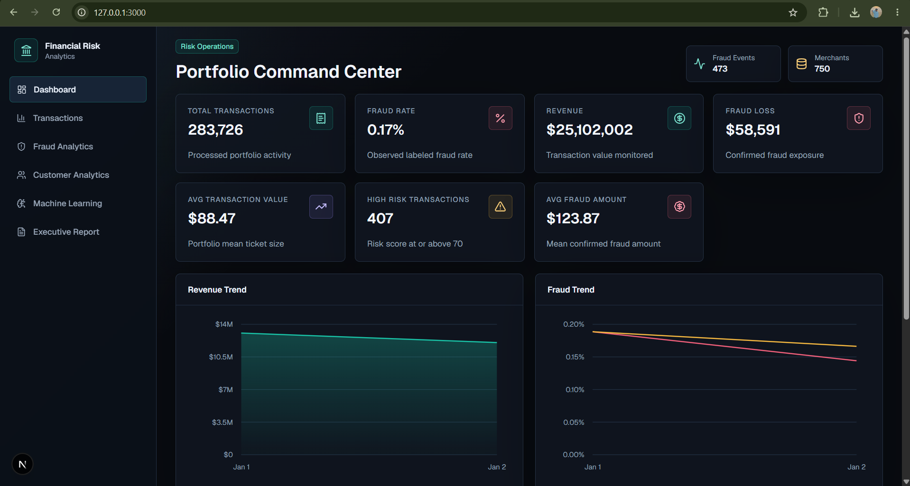
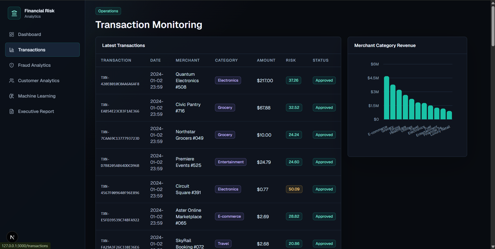
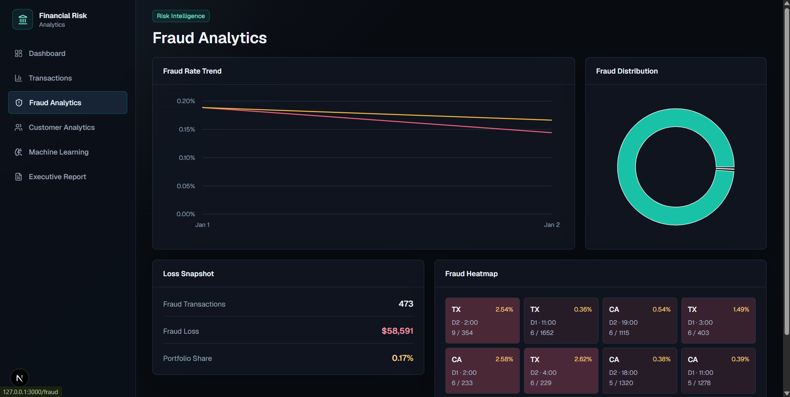
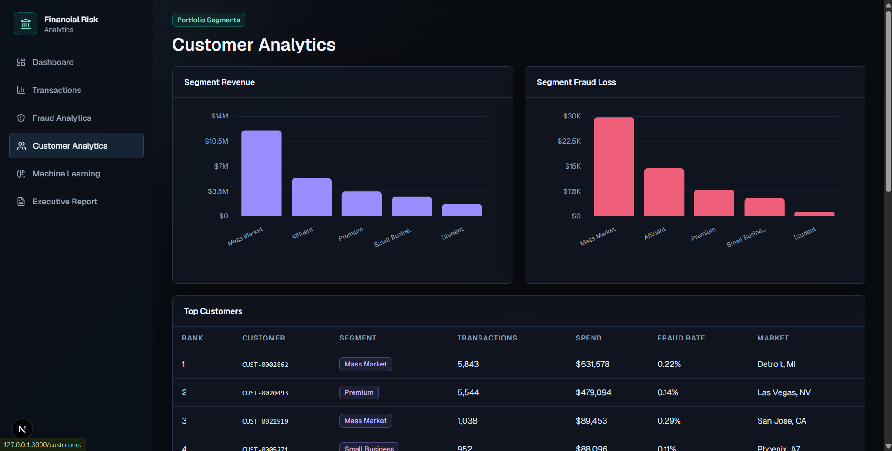
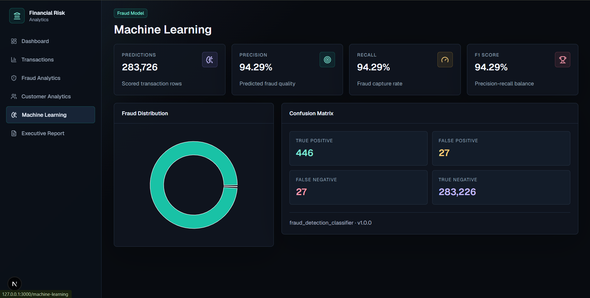
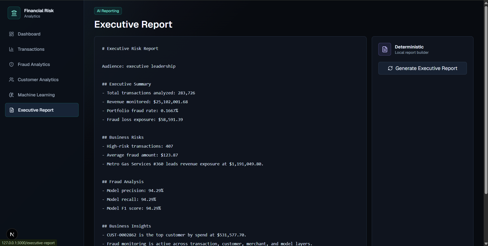

# Financial Risk Analytics Dashboard

Enterprise analytics platform for credit card fraud risk, revenue monitoring, customer analysis, machine learning performance tracking, and AI-assisted executive reporting.

The project uses the Kaggle Credit Card Fraud Detection dataset as the raw source file. The original dataset is stored at `data/raw/creditcard.csv` and must remain unchanged. All transformations are written to `data/processed/`.

## Project Snapshot

The dashboard module is built and visually verified locally across the core product pages: command center, transaction monitoring, fraud analytics, customer analytics, machine learning, and executive reporting.

| Area | Current Result |
| --- | ---: |
| Processed transactions | 283,726 |
| Labeled fraud events | 473 |
| Portfolio fraud rate | 0.17% |
| Revenue monitored | $25,102,002 |
| Confirmed fraud exposure | $58,591 |
| Average transaction value | $88.47 |
| High-risk transactions | 407 |
| Merchants monitored | 750 |
| Model predictions | 283,726 |
| Model accuracy | 99.98% |
| Model precision / recall / F1 | 94.29% / 94.29% / 94.29% |

The precision, recall, and F1 score are identical in the current validation run because the confusion matrix is symmetric on the error classes: 446 true positives, 27 false positives, and 27 false negatives.

## Architecture

```text
Raw Dataset
  -> ETL Pipeline
  -> PostgreSQL Database
  -> SQL Analytics
  -> Machine Learning
  -> FastAPI
  -> Next.js Dashboard
  -> AI Executive Reports
```

## Current Module Status

This repository has completed the setup, data organization, ETL, database, machine learning, backend, frontend, and deployment-readiness modules:

- Production folder structure created.
- Raw dataset moved to `data/raw/creditcard.csv`.
- Baseline environment template added.
- PostgreSQL Docker Compose service added.
- Data and generated artifact paths protected by `.gitignore`.
- Deterministic ETL package added under `etl/`.
- Processed dataset output path: `data/processed/transactions_enriched.csv`.
- ETL quality report path: `data/processed/etl_quality_report.json`.
- PostgreSQL schema, migrations, indexes, constraints, and refresh functions added.
- Analytics SQL views and materialized views added under `database/sql/`.
- Processed-to-PostgreSQL loader added at `scripts/load_processed_to_postgres.py`.
- Fraud detection model training package added under `ml/`.
- Model artifact path: `ml/models/fraud_model.pkl`.
- Model metrics path: `ml/reports/model_performance.json`.
- Prediction export path: `data/exports/fraud_predictions.csv`.
- FastAPI backend package added under `backend/`.
- Backend API docs: `http://localhost:8000/docs`.
- Next.js dashboard added under `frontend/`.
- Frontend app URL: `http://localhost:3000`.
- Render Blueprint added at `render.yaml`.
- Vercel project config added at `frontend/vercel.json`.
- Deployment runbook added at `docs/deployment.md`.

## Completed Capabilities

- Deterministic ETL pipeline with schema validation, data quality checks, and business enrichment.
- Normalized PostgreSQL model for customers, merchants, transactions, fraud predictions, and daily metrics.
- SQL analytics with views, materialized views, CTEs, window functions, rolling fraud rates, rankings, and revenue trends.
- Fraud detection models using logistic regression and random forest.
- FastAPI backend with typed response models for dashboard, machine learning, and AI reporting endpoints.
- Next.js 15 dashboard with TypeScript, Tailwind CSS, Shadcn UI, TanStack Table, Recharts, and Framer Motion.
- OpenAI-powered executive report generation from current dashboard KPIs.
- Docker-based local development for infrastructure and services.

## Folder Structure

```text
Financial-Risk-Analytics-Dashboard/
|-- data/
|   |-- raw/
|   |   `-- creditcard.csv
|   |-- processed/
|   `-- exports/
|-- backend/
|-- frontend/
|-- database/
|   |-- schema/
|   |-- sql/
|   `-- migrations/
|-- etl/
|-- ml/
|   `-- models/
|-- docs/
|-- tests/
|-- docker/
|-- scripts/
|-- .env.example
|-- .gitignore
|-- docker-compose.yml
`-- README.md
```

## Dataset

Primary dataset: `data/raw/creditcard.csv`

Expected source columns:

- `Time`
- `V1` through `V28`
- `Amount`
- `Class`

Class labels:

- `0`: Genuine transaction
- `1`: Fraudulent transaction

## Local Setup

1. Copy `.env.example` to `.env` and update secrets for local development.
2. Start PostgreSQL:

```bash
docker compose up -d postgres
```

PostgreSQL is exposed on host port `55432` by default to avoid collisions with local PostgreSQL services on `5432`.

3. Confirm the raw dataset exists:

```bash
ls data/raw/creditcard.csv
```

4. Run the deterministic ETL pipeline:

```bash
python -m etl
```

5. Run ETL validation checks:

```bash
python -m compileall etl scripts tests
python -m unittest discover -s tests
```

6. Load processed data into PostgreSQL:

```bash
python scripts/load_processed_to_postgres.py --replace
```

7. Train fraud detection models:

```bash
python -m ml
```

8. Load fraud predictions into PostgreSQL:

```bash
python scripts/load_fraud_predictions_to_postgres.py
```

9. Run the FastAPI backend:

```bash
uvicorn backend.app.main:app --reload --host 127.0.0.1 --port 8001
```

10. Run the Next.js dashboard:

```bash
cd frontend
npm install
npm run dev -- --hostname 127.0.0.1 --port 3000
```

## Screenshots

### Portfolio Command Center



### Transaction Monitoring



### Fraud Analytics



### Customer Analytics



### Machine Learning



### Executive Report



## Deployment Targets

- Frontend: Vercel
- Backend API: Render Docker web service
- Database: Neon PostgreSQL
- Local infrastructure: Docker Compose

## Deployment

The repo is configured for Neon, Render, and Vercel deployment:

- Render Blueprint: `render.yaml`
- Backend container: `backend/Dockerfile`
- Vercel config: `frontend/vercel.json`
- Full runbook: `docs/deployment.md`

Generated data and model artifacts are not committed. After Neon creates the managed PostgreSQL database, load it from local generated artifacts:

```powershell
$env:DATABASE_URL = "<neon-postgres-connection-string>"
python scripts/load_processed_to_postgres.py --replace --database-url $env:DATABASE_URL
python scripts/load_fraud_predictions_to_postgres.py --database-url $env:DATABASE_URL
```

## Future Scope

- Role-based access control for analysts, risk managers, and executives.
- Scheduled ETL orchestration.
- Model drift monitoring.
- Alerting for high-risk transaction spikes.
- Exportable executive reports.
- CI pipeline for linting, testing, and container builds.
